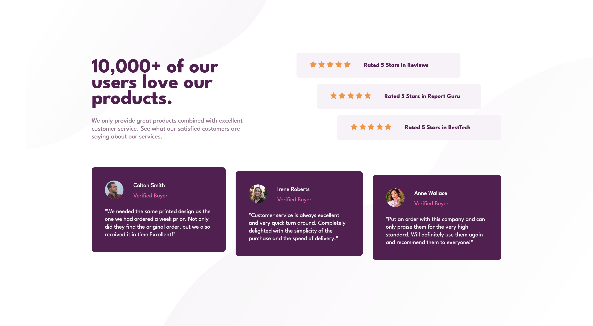
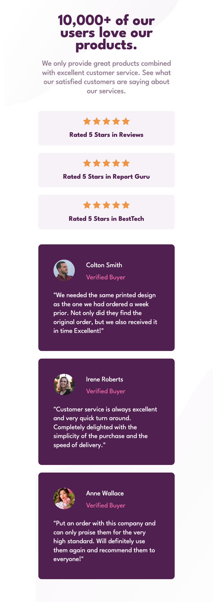

# Frontend Mentor - Social proof section solution

This is a solution to the [Social proof section challenge on Frontend Mentor](https://www.frontendmentor.io/challenges/social-proof-section-6e0qTv_bA). Frontend Mentor challenges help you improve your coding skills by building realistic projects.

## Table of contents

- [Overview](#overview)
  - [The challenge](#the-challenge)
  - [Screenshot](#screenshot)
  - [Links](#links)
  - [Built with](#built-with)
  - [What I learned](#what-i-learned)
  - [Continued development](#continued-development)
- [Author](#author)

## Overview

### The challenge

Users should be able to:

- View the optimal layout for the section depending on their device's screen size

### Screenshot

### Links

- Solution URL: [Solution](https://github.com/abhishek-baliyan-dev/Frontend-mentor-challenge-Social-proof-section)
- Live Site URL: [Live](https://abhishek-baliyan-dev.github.io/Frontend-mentor-challenge-Social-proof-section/)

### Built with

- Semantic HTML5 markup
- CSS custom properties
- Flexbox
- Mobile-first workflow

### What I learned

- More experince in layout with flexbox.

### Continued development

- Grid

## Author

- Website - [Abhishek Baliyan](https://www.abhishekbaliyan.com) - Coming soon
- Frontend Mentor - [@abhishek-baliyan-dev](https://www.frontendmentor.io/profile/abhishek-baliyan-dev)
- Twitter - [@Abhi___baliyan](https://twitter.com/Abhi___baliyan)
- Dev.to - [@abhishekbaliyandev](https://dev.to/abhishekbaliyandev)
